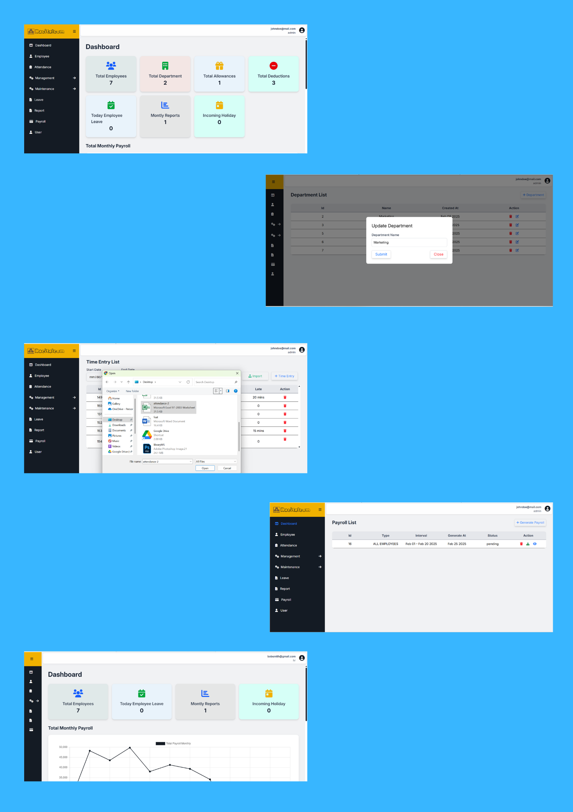

# Racitelcom - Payroll Management System Website

## Overview 📌
The **Racitel Payroll Management** System is an all-in-one solution created for Racitelcom Inc. to optimize payroll processing and employee attendance tracking. This system automates salary calculations, ensuring precision and efficiency in payroll generation. It simplifies the recording of employee work hours by allowing attendance data to be imported via CSV files. By automating essential processes, Racitel minimizes manual errors, saves valuable time, and facilitates smooth workforce management.

---

## Sample Website Design Highlight


---

## Features 📌

### **Admin Dashboard**
- **Total Employee Count**: View the total number of employees.
- **Total Departments**: View the number of active departments.
- **Total Allowances**: Display total allowances across all employees.
- **Total Deductions**: Display total deductions across all employees.
- **Leave Summary**: View the total number of leave requests for today.
- **Monthly Report**: number of report monthly.
- **Upcoming Holidays**: Track any upcoming holidays.

### **Employee Management**
- **CRUD Operations**: Create, read, update, and delete employee listings.

### **Attendance Management**
- **CRUD Operations**: Handle employee attendance records (add, view, modify, delete) and import attendance via CSV file.

### **Payroll Management**
- **CRUD Operations**: Manage payroll records.
- **Download PDF**: Generate and download payroll reports as PDFs.

### **Allowance and Deduction Management**
- **CRUD Operations**: Manage employee allowances and deductions.

### **Maintenance**
- **Department Management**: Create, update, and delete departments.
- **Position Management**: Manage employee positions.
- **Schedule Management**: Set employee schedules.
- **Holiday Management**: Define and manage holidays.
- **Allowance & Deduction Management**: Add or remove allowances and deductions.
- **Leave Management**: Manage employee leave records.

### **Leave Management**
- **Employee Leave**: View and manage the list of employee leave requests.

### **Reports**
- **CRUD Operations**: Create, read, update, delete, and download reports in PDF format.

### **User Management**
- **Role Management**: Update user roles, create new accounts, and disable accounts.

### **HR Account**
- **Limited Access**: HR accounts cannot access maintenance features, ensuring they only manage employee-related functions.

### **Login/Logout**
- **Secure Login**: Allows users to securely log in and log out of the system.

---

## Tech Stack 📌
- **Frontend**: HTML, CSS, Tailwind CSS
- **Backend**: PHP
- **Database**: MySQL

---

## Design Patterns 📌

This system utilizes the following design patterns to ensure maintainability, scalability, and separation of concerns:

### **MVC (Model-View-Controller)**
- The **MVC pattern** divides the application into three interconnected components:
  - **Model**: Responsible for handling the data and business logic, including interactions with the database.
  - **View**: Represents the user interface (UI), presenting the data to users.
  - **Controller**: Acts as an intermediary between the Model and View, processing user input and managing interactions.

### **Facade**
- The **Facade pattern** provides a simplified interface to a complex subsystem, making the system easier to use and maintain. By providing a higher-level interface to the underlying system, it hides the complexity of interactions with various components (like database queries or business logic), improving the ease of use and reducing dependencies.

### **Dependency Injection**
- **Dependency Injection (DI)** is used to manage the dependencies between classes and components. Instead of creating instances of dependencies within classes, objects are passed as dependencies. This improves flexibility, makes the code more testable, and promotes loose coupling between components, allowing easier changes and unit testing.

By combining **MVC**, **Facade**, and **Dependency Injection**, the system maintains a high level of modularity, flexibility, and maintainability, enabling efficient management of employee data and payroll processes.

---

## Additional Features

### **Security** 🔒
The system employs industry-standard security practices to ensure the protection of sensitive information and prevent unauthorized access:

- **JWT (JSON Web Tokens)**: Used for secure user authentication, ensuring each user is validated and authorized to access the system.
- **Password Hashing**: User passwords are securely stored using the modern bcrypt hashing algorithm, which prevents the storage of plain-text passwords in the database.
- **Base64 Encoding**: Used for encoding certain data to ensure safe transmission over the network.
- **CSRF Protection**: Implements **Cross-Site Request Forgery (CSRF)** protection to prevent unauthorized requests and ensure that all sensitive actions are secure and originate from authenticated users.
- **Secure Login**: User credentials are transmitted securely over **SSL/TLS** encryption, ensuring that login data is protected from man-in-the-middle attacks.

## Installation Instructions (Racitelcom Project)

1. **Clone the repository:**
    - Clone the Racitelcom repository to your local machine:
        ```bash
        git clone [https://github.com/Ejxzdevs/Racitelcom.git](https://github.com/Ejxzdevs/Racitelcom.git)
        ```

2. **Navigate to the project directory:**
    - Change your current directory to the Racitelcom directory:
        ```bash
        cd Racitelcom
        ```

3. **Install Composer dependencies:**
    - Ensure Composer is installed. If not, download and install it from [getcomposer.org](https://getcomposer.org/download/).
    - Install the required packages:
        ```bash
        composer install
        ```

4. **Configure environment variables:**
    - Create a `.env` file in the project's root directory.
    - Copy and paste the following content into your `.env` file, **adjusting the values to match your specific environment**:
        ```ini
        DB_HOST=localhost
        DB_USERNAME=root
        DB_PASSWORD=your_database_password
        DB_NAME=payroll
        SECRET_KEY=your_generated_secret_key
        AES_SECRET_KEY=your_generated_aes_secret_key

        ```
    - **Important:** Ensure your PHP code uses a library like `vlucas/phpdotenv` to load these variables.

5. **Database setup:**
    - Since your database file (`payroll`) is in the root directory of the project, you likely have a `.sql` file there.
    - Open your database client (e.g., phpMyAdmin, SQLyog, HeidiSQL, or command-line MySQL client).
    - Create a database named `payroll` on your MySQL server.
    - Import the `payroll` database from the `.sql` file located in your project's root directory.

6. **Web server configuration (Laragon/XAMPP):**
    - **Laragon:**
        - Move the `Racitelcom` folder into your Laragon's `www` directory.
    - **XAMPP:**
        - Move the `Racitelcom` folder into your XAMPP's `htdocs` directory.

7. **Access the application:**
    - Open your web browser and navigate to the configured URL, such as `http://localhost/Racitelcom/."**`
