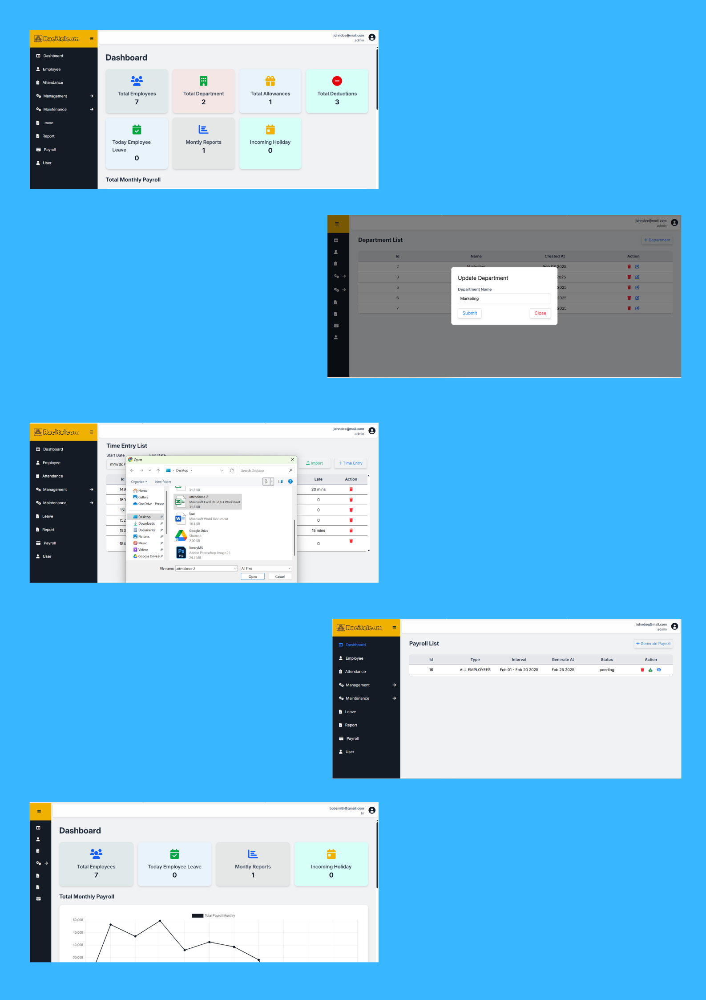

# Racitelcom - Payroll Management System Website

## Overview 📌

The **Racitel Payroll Management System** is an all-in-one solution designed for **Racitelcom Inc.** to streamline payroll processing and employee attendance tracking. The system automates salary calculations, ensuring precision and efficiency in payroll generation. Attendance records can be imported via CSV, simplifying workforce management and minimizing manual errors.  

This platform empowers HR and administrative teams with real-time insights into employee data, payroll, and leave management, facilitating smooth organizational operations.  

---

## Sample Website Design Highlight

  

---

## Features 📌

### **Admin Dashboard**
- Total employee count  
- Total departments  
- Total allowances and deductions  
- Daily leave summary  
- Monthly report overview  
- Upcoming holiday tracker  

### **Employee Management**
- Create, read, update, and delete employee records  

### **Attendance Management**
- Manage attendance records (add, view, modify, delete)  
- Import attendance data via CSV files  

### **Payroll Management**
- Handle payroll records  
- Generate and download payroll reports as PDFs  

### **Allowance and Deduction Management**
- Manage employee allowances and deductions  

### **Maintenance**
- Department, position, schedule, and holiday management  
- Add or remove allowances and deductions  
- Leave record management  

### **Leave Management**
- Track and manage employee leave requests  

### **Reports**
- Create, read, update, delete, and download reports in PDF format  

### **User Management**
- Role-based account management  
- Enable/disable accounts with controlled access  

### **HR Account**
- Restricted access for HR accounts to only employee-related functions  

### **Login/Logout**
- Secure login and logout functionality  

---

## Tech Stack 📌
- **Frontend**: HTML, CSS, Tailwind CSS  
- **Backend**: PHP  
- **Database**: MySQL  

---

## Summary 📌

The Racitel Payroll Management System is a robust, secure, and scalable platform for managing payroll, attendance, and employee data. With its modular design, comprehensive features, and advanced security measures, it provides an efficient and reliable solution for workforce management at Racitelcom Inc.
